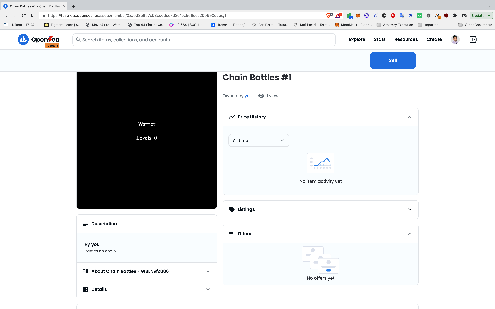

# Making NFTs with On Chain Metadata
This project shows how to create NFTs with on chain metadata for use in an onChain gaming dApp.

## Requirements
0. Metamask Private Key, Alchemy free account, Polygon Scan Mumbai Api Key.
1. Web3 compatible browser (Brave suggested)
2. Metamask
3. Polygon Network [Mumbai Testnet Matic Token](https://mumbaifaucet.com/)
4. Hardhat
```javascript
npm install hardhat --save-dev)
```
5. Packages: OpenZeppelin contracts, hardhat-etherscan, dotenv
```javascript
npm install @openzeppelin/contracts @nomiclabs/hardhat-etherscan dotenv
```
6. Be sure to populate .env in root project directory with TESTNET_URL, POLYGONSCAN_API_KEY, and PRIVATE_KEY
7. Compile code from repository directory
```javascipt
npx hardhat compile
```
8. Deploy code to Polygon Mumbai and save contract address returned
```javascipt
npx hardhat run scripts/deploy.js --network mumbai
```
9. Verify contract code on Polygon Scan Mumbai, returns URL https://mumbai.polygonscan.com/address/0xA0D8e657c03CeDDeE7d2d1eC506CCa200690c2bE#code (My contract code)
```javascipt
npx hardhat --verify <CONTACT ADDRESS FROM #8> --network mumbai
```
10. Interact with contract in Polygon Scan, Mint.
11. Verify on [OpenSea](https://testnets.opensea.io/account)

12. Level up by executing train on Polygon Scan with '1' as the value (We only minted one NFT)
13. Verify on [OpenSea](https://testnets.opensea.io/account)


```
1. Connect Wallet
2. Ensure on appropriate Web3 Network (Ethereum Goerli)
3. Enter Name
4. Write a friendly message
5. Sign request
```
